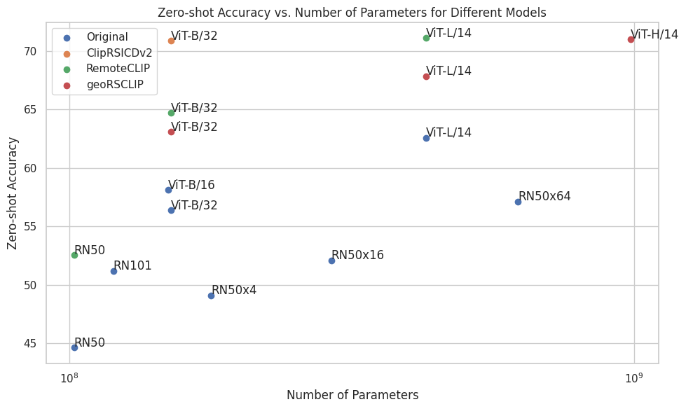
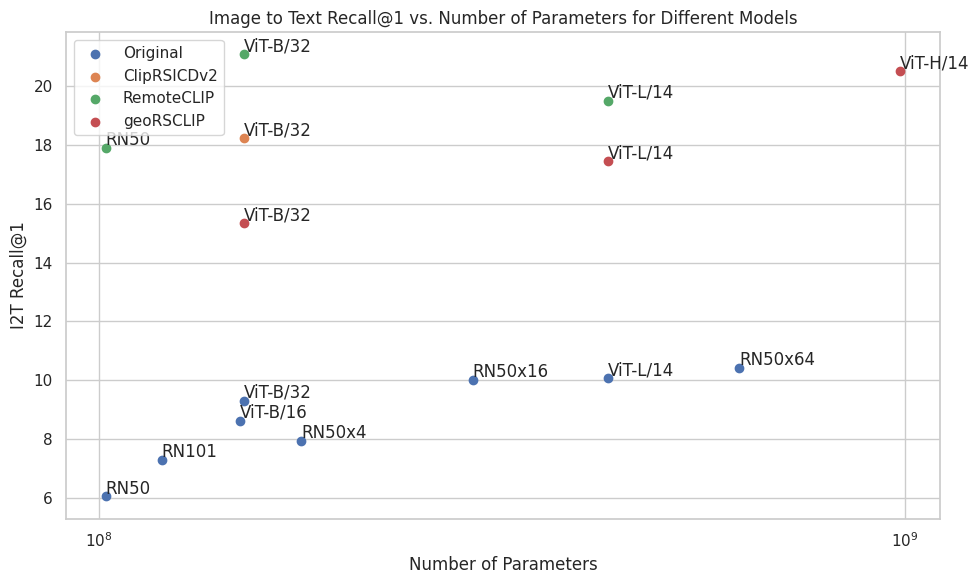

# VT-RSBS: Vision-Text Remote Sensing Benchmarking System

## Evaluate your vision language embeddings for remote sensing applications


### Authors:
- **Alberto Frizzera**  
  Email: [info@albertofrizzera.com](mailto:info@albertofrizzera.com)

- **Riccardo Ricci**  
  Email: [riccardo.ricci-1@unitn.it](mailto:riccardo.ricci-1@unitn.it)

## Introduction

Embeddings are mathematical representations of data. They usually take the form of vectors, and the cool thing is that they are not random, but carry information (they "represent" something).
For example, if we consider images, "similar" images should have similar embeddings.
The concept of similarity is entirely enforced during training.

Consider two images, one that contains a horse and one that contains a fish, they are probably visually different, but they share the concept of representing animals. In remote sensing, suppose to take an image of a forest and an image of a field. They are visually different, but they share the concept of being a vegetated area.

Ideally, embeddings are mathematical representations that condense all this knowledge in a single vector, whose values can "agree" or "disagree" with that of other vectors. If the values agree, the vectors are similar (in whatever sense), if they disagree, they are different.

As mentioned before, the agreement or disagreement is entirely enforced by the training process. Indeed, if you divide satellite images into rural or urban and train a model to produce similar embeddings for images of the same class, you will have a model that can produce embeddings that condense the meaning of "urban" or "rural", whatever that might be according to the training dataset. 

If you think about it, this is a very powerful concept. However, training a model to distinguish various concepts requires the collection of a dataset that explain those concepts. This is costly, time consuming, and it might be very difficult to have a wide coverage of different topics, concepts, classes and so on. 

This is where vision-language contrastive learning placed itself. I like to think about it that way, through language, there is no need to collect a dataset that explains the concepts. Instead, we can use image descriptions as a way to convey information at different levels, implicitly having the network to learn to discriminate between different "concepts". 

Think of having two images, one with the caption "a dense forest with green trees where some buildings are visible through the vegetation", and another one that reads "a residential area in a forested landscape".
These two captions, while describing different images, they share the concept of the presence of buildings and trees, and that is a residential area. And they will assign these concepts to the images, arriving to produce similar embeddings for both "buildings" "trees" "residential area", but also "buildings in vegetation" or "forest".

The first work to propose this paradigm at a very large scale (400M images) is the paper "[Learning Transferable Visual Models From Natural Language Supervision](https://arxiv.org/pdf/2103.00020)", where the authors propose the famous CLIP model. 
Using descriptions of the image, the authors showed that the model was able to learn very generalizable embeddings. CLIP embeddings can be used for zero-shot image classification, where the labels are converted into template descriptions, and then the one with the highest agreement is deemed as the correct class. Tested on a suite of different image classification datasets, CLIP outperformed or achieved competitive results on the majority of them (also fully supervised baselines) without the need of fine-tuning.

These vision-language embeddings can be useful for text-image retrieval, image-text retrieval, image captioning among others. However, it is difficult to correctly evaluate them, for the lack of a common benchmark system. 
Indeed, some papers tackled the problem of adapting CLIP for remote sensing, but the lack evaluation systems causes the results to not be comparable.

To solve this issue, we built this benchmarking system and assessed the performance of some public algorithms. We are constantly updating the benchmark with new models and datasets, and we are open to any contribution. Feel free to open an issue :)

The benchmark implements 4 tasks
- image classification
- linear probing
- text-to-image retrieval (T2I)
- image-to-text retrieval (I2T)

and evaluates them on a suite of remote sensing datasets.

We provide numerical results of public models such as the original CLIP, other CLIP like architectures fine-tuned for remote sensing, to have your performance calibrated on the other models. You can find all informations about the model tested in the models section.

## Models 
- [CLIP](https://github.com/openai/CLIP) Original CLIP models from OPENAI.
- [CLIPrsicdv2](https://huggingface.co/flax-community/clip-rsicd-v2) Finetuned CLIP model on images from the RSICD dataset
- [RemoteCLIP](https://github.com/ChenDelong1999/RemoteCLIP) Finetuned CLIP models using a large collection of high-quality image text pairs (around 160K pairs)
- [GeoRSCLIP](https://huggingface.co/Zilun/GeoRSCLIP) Finetuned CLIP model on 5M noisy image-text pairs from the remote sensing domain.

## Usage
### Installation
1. Create a virtual environment and install everything in it.
```
conda create --name remotextvis python=3.10
conda activate remotextvis
pip install -r requirements.txt
```
2. Adjust the environmental variables of the dataset in ```.env``` in order to properly locate the datasets.
You can download the datasets, prepare them, and evaluate your model easily. 
> **_Note:_**  Click [here](assets/dataset_preparation.md) for instructions on how to download and prepare the datasets

If you don't want to waste time downloading the datasets, you can provide me your model and I will run the benchmark for you, including it in the evaluation. I just need the model weights and the three functions below.

1. **Load Function**: 
    - **Output**: This function should return three callables: `model`, `text_processor`, and `image_processor`.
        - **Model**: The model itself.
        - **Text Processor**: A function that takes a list of strings as input and tokenizes them, producing a tensor of indices of size BxL (with tensors padded to the maximum length).
        - **Image Processor**: A function that takes a single PIL Image as input and applies transformations, producing a tensor of size CxHxW.

    This is an example:
    ```python
    def load_clipRSICDv2(model_name:str, device:str):
        '''
        Loads the CLIPrsicdv2 model.
        '''
        model = CLIPModel.from_pretrained(model_name)
        model.to(device)
        textprocessor = CLIPTokenizer.from_pretrained(model_name)
        imageprocessor = CLIPImageProcessor.from_pretrained(model_name)
        
        return model, textprocessor, imageprocessor
    ```

2. **Text Embedding Function**:
    - **Input**: The function takes the model, a list of texts (strings), and the device.
    - **Process**: Preprocesses the text using the `text_processor` and produces embeddings using the model.
    - **Output**: Returns embeddings as a tensor of shape BxD, where D is the embedding dimension.

    This is an example: 
    ```python
    def encode_text_CLIPrsicdv2(model:CLIPModel, textprocessor:CLIPTokenizer, texts:List[str], device:str):
        '''
        This function takes a list of texts and returns their embeddings using CLIPrsicdv2
        '''
        text_inputs = textprocessor(texts, return_tensors="pt", padding=True)
        text_embeddings = model.get_text_features(input_ids=text_inputs["input_ids"].to(device), attention_mask=text_inputs["attention_mask"].to(device))
        
        return text_embeddings
    ```

3. **Image Embedding Function**:
    - **Input**: The function takes the model, a list of images (PIL.Image objects), and the device.
    - **Process**: Preprocesses the images using the `image_processor` and produces embeddings using the model.
    - **Output**: Returns embeddings as a tensor of shape BxD, where D is the embedding dimension.

    This is an example:
    ```python
    def encode_image_CLIPrsicdv2(model:CLIPModel, imageprocessor:CLIPImageProcessor, images:List[PIL.Image.Image], device:str):
        '''
        This function takes a list of images and returns their embeddings using CLIPrsicdv2
        '''
        image_inputs = imageprocessor(images, return_tensors="pt")
        image_embeddings = model.get_image_features(pixel_values=image_inputs["pixel_values"].to(device))
        return image_embeddings
    ```

After you have defined these functions, you can evaluate your model by following these steps:
1. Modify the beginning of the module ```eval.py``` by importing your custom functions, and replacing them after "load_function", "encode_text_fn" and "encode_image_fn".
2. Modify the templates, placing the ones that you want to use for evaluation.
3. Run ```eval.py```.
4. Collect the results in the ```reports/``` folder. The report is saved as a txt file.

## Datasets

### Zero shot classification
- [X] [UCM](http://weegee.vision.ucmerced.edu/datasets/landuse.html)
- [X] [WHU_RS19](https://captain-whu.github.io/BED4RS/#)
- [X] [RSSCN7](https://github.com/palewithout/RSSCN7)
- [X] [SIRI_WHU](http://www.lmars.whu.edu.cn/prof_web/zhongyanfei/e-code.html)
- [X] [RESISC45](https://figshare.com/articles/dataset/NWPU-RESISC45_Dataset_with_12_classes/16674166)
- [X] [RSI_CB128](https://github.com/lehaifeng/RSI-CB)
- [X] [RSI_CB256](https://github.com/lehaifeng/RSI-CB)
- [X] [EuroSAT](https://github.com/phelber/eurosat)
- [X] [PatternNet](https://sites.google.com/view/zhouwx/dataset)
- [X] [OPTIMAL_31](https://huggingface.co/datasets/jonathan-roberts1/Optimal-31)
- [X] [MLRSNet](https://github.com/cugbrs/MLRSNet)
- [X] [RSICD](https://github.com/201528014227051/RSICD_optimal)
- [X] [RSITMD](https://github.com/xiaoyuan1996/AMFMN)


### Image retrieval
- [X] [RSICD](https://github.com/201528014227051/RSICD_optimal)
- [X] [RSITMD](https://github.com/xiaoyuan1996/AMFMN)
- [X] [SIDNEY](https://mega.nz/folder/pG4yTYYA#4c4buNFLibryZnlujsrwEQ)
- [X] [UCM](https://mega.nz/folder/wCpSzSoS#RXzIlrv--TDt3ENZdKN8JA)

Datasets marked with [X] are already implemented and included in the benchmark.

We are constantly updating the number of datasets that we support for testing. 
<!-- If needed, an exhaustive list of other satellite datasets is available [here](https://captain-whu.github.io/DiRS/). -->

To visualize the samples of all the above datasets, a web tool has been implemented (```web_app/main.py```)

### Dataset preparation
Each dataset should be downloaded and preprocessed accoring to the instructions in [dataset preparation](assets/dataset_preparation.md).

## Benchmark Models
The following figures report results on zero-shot classification, linear probing and retrieval of the models in literature up to now. There are original models, as well as models fine-tuned on remote sensing datasets.

For a detailed breakdown on each dataset, refer to the [report](md_files/single_model_breakdown.md).

### Zero-shot classification accuracy (%)


### Linear probe accuracy (%)


### Text to Image Recall @ 1 (%)


### Image to Text Recall @ 1 (%)


### BIBTEX
```
@inproceedings{Radford2021LearningTV,
    title={Learning Transferable Visual Models From Natural Language Supervision},
    author={Alec Radford and Jong Wook Kim and Chris Hallacy and Aditya Ramesh and Gabriel Goh and Sandhini Agarwal and Girish Sastry and Amanda Askell and Pamela Mishkin and Jack Clark and Gretchen Krueger and Ilya Sutskever},
    booktitle={International Conference on Machine Learning},
    year={2021},
    url={https://api.semanticscholar.org/CorpusID:231591445}
    }
```